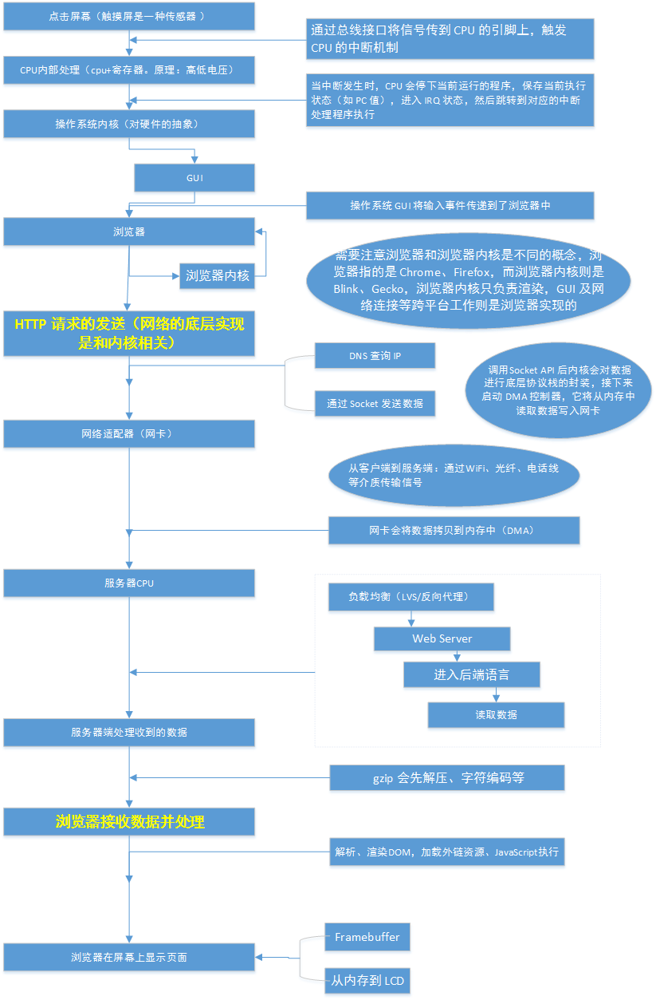
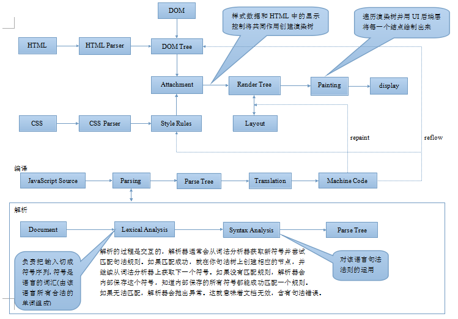

# JavaScript的装载和执行

- 浏览器并行下载css文件
- 浏览器对于JavaScript的运行有两大特性：

**1）载入后马上执行，**

**2）执行时会阻塞页面后续的内容（包括页面的渲染、其它资源的下载）** 

**JavaScript阻塞其他资源的加载的原因是：浏览器为了防止JavaScript修改DOM树，需要重新构建DOM树的情况出现**； 

> 如果有多个JavaScript文件被引入，那么对于浏览器来说，这些JavaScript文件被被串行地载入，并依次执行。 

参考文章：

1、[从输入 URL 到页面加载完成的过程中都发生了什么事情？](http://fex.baidu.com/blog/2014/05/what-happen/)

2、[what-really-happens-when-you-navigate-to-a-url](http://igoro.com/archive/what-really-happens-when-you-navigate-to-a-url/)

3、[How browsers work](http://taligarsiel.com/Projects/howbrowserswork1.htm) —— 被称为“神文”

4、[Javascript 装载和执行](http://www.linjunlong.com/p/1156.html)

5、[关于html，css，js三者的加载顺序问题](http://www.cnblogs.com/Yoriluo/p/6783081.html)

6、[HTML从输入URL到页面渲染过程](https://hanyub.github.io/2016/07/14/HTML%E4%BB%8E%E8%BE%93%E5%85%A5URL%E5%88%B0%E9%A1%B5%E9%9D%A2%E6%B8%B2%E6%9F%93%E8%BF%87%E7%A8%8B/)