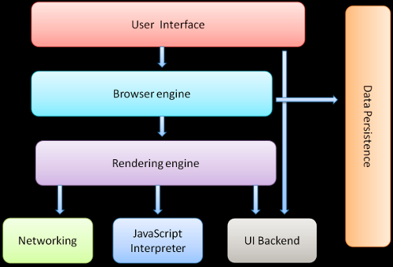

# Event loop


> event loop 属于浏览器的特性，事件队列由浏览器维护。

## 一、前置基础知识

- ### CPU 

  > CPU是计算机的核心，其负责承担计算机的计算任务。这里我们比喻为一个工厂 

- ### 进程(process)  

  > **进程是一个具有一定独立功能的程序在一个数据集上的一次动态执行的过程，是操作系统进行资源分配和调度的一个独立单位，是应用程序运行的载体**。我们这里将进程比喻为工厂的车间，它代表CPU所能处理的单个任务。任一时刻，CPU总是运行一个进程，其他进程处于非运行状态。 

- ### 线程（thread）

  > 在早期的操作系统中并没有线程的概念，进程是能拥有资源和独立运行的最小单位，也是程序执行的最小单位。任务调度采用的是时间片轮转的抢占式调度方式，而进程是任务调度的最小单位，每个进程有各自独立的一块内存，使得各个进程之间内存地址相互隔离。后来，随着计算机的发展，对CPU的要求越来越高，进程之间的切换开销较大，已经无法满足越来越复杂的程序的要求了。于是就发明了线程，**线程是程序执行中一个单一的顺序控制流程，是程序执行流的最小单元**。这里把线程比喻一个车间的工人，即一个车间可以允许由多个工人协同完成一个任务 

- ### 进程和线程的区别和关系

  > 1. 进程是**操作系统分配资源的最小单位**，**线程是程序执行的最小单位**(线程共享进程分配的内存等)。
  > 2. 一个进程由一个或多个线程组成，线程是一个进程中代码的不同执行路线；
  > 3. **进程之间相互独立**，但**同一进程下的各个线程之间共享程序的内存空间**(包括代码段、数据集、堆等)及一些进程级的资源(如打开文件和信号)。
  > 4. 调度和切换：线程上下文切换比进程上下文切换要`快得多`。
  > 5.  通性：都包含三个状态，就绪、阻塞、运行。通俗的讲，阻塞就是资源未到位，等待资源中。就绪，就是资源到位了，但是CPU未到位，还在运行其他。 

- ### 多进程和多线程

  > 1. 多进程：多进程指的是在同一个时间里，**同一个计算机系统中如果允许两个或两个以上的进程处于运行状态**。多进程带来的好处是明显的，比如你可以听歌的同时，打开编辑器敲代码，编辑器和听歌软件的进程之间丝毫不会相互干扰。
  > 2. 多线程是指程序中包含多个执行流，即在**一个程序中可以同时运行多个不同的线程来执行不同的任务**，也就是说允许单个程序创建多个并行执行的线程来完成各自的任务。


## 二、浏览器与浏览器内核



- ### 浏览器的多进程架构

  Chrome浏览器使用多个进程来隔离不同的网页。因此在**Chrome中打开一个网页（新开一个tab）相当于起了一个进程** 。

		在浏览器刚被设计出来的时候，那时的网页非常的简单，每个网页的资源占有率是非常低的，因此**一个进程处理多个网页时可行的**。然后在今天，大量网页变得日益复杂。把所有网页都放进一个进程的浏览器面临在**健壮性，响应速度，安全性**方面的挑战。因为如果浏览器中的**一个tab网页崩溃的话，将会导致其他被打开的网页应用崩溃**。另外相对于线程，进程之间是不共享资源和地址空间的,所以不会存在太多的安全问题，而由于多个线程共享着相同的地址空间和资源,所以会存在`线程之间有可能会恶意修改或者获取非授权数据等复杂的安全问题。`


- ### 浏览器内核

​       简单来说浏览器内核是**通过取得页面内容、整理信息（应用CSS）、计算和组合最终输出可视化的图像结果，通常也被称为渲染引擎（Rendering engine）**。从上面我们可以知道，Chrome浏览器为每个tab页面单独启用进程，因此**每个tab网页都有由其独立的渲染引擎实例**。 


- ### 浏览器内核是多线程的

  浏览器内核是多线程，在内核控制下各线程相互配合以保持同步，一个浏览器通常由以下常驻线程组成：

  1. **GUI 渲染线程** (与**JavaScript引擎线程**互斥)

     > GUI渲染线程负责渲染浏览器界面HTML元素,当界面需要重绘(Repaint)或由于某种操作引发回流(reflow)时,该线程就会执行。在Javascript引擎运行脚本期间,GUI渲染线程都是处于挂起状态的,也就是说被”冻结”了. 

  2. **JavaScript引擎线程**（与**GUI 渲染线程**互斥）

  > Javascript引擎，也可以称为JS内核，主要负责处理Javascript脚本程序，例如V8引擎。Javascript引擎线程理所当然是负责解析Javascript脚本，运行代码。 

  3. 定时触发器线程

  > 浏览器定时计数器并不是由JavaScript引擎计数的, 因为JavaScript引擎是单线程的, 如果处于阻塞线程状态就会影响记计时的准确, 因此通过单独线程来计时并触发定时是更为合理的方案。 

  4. 事件触发线程

  > 当一个事件被触发时该线程会把事件添加到待处理队列的队尾，等待JS引擎的处理。这些事件可以是当前执行的代码块如定时任务、也可来自浏览器内核的其他线程如鼠标点击、AJAX异步请求等，但由于JS的单线程关系所有这些事件都得排队等待JS引擎处理 

  5. 异步http请求线程

  > 在XMLHttpRequest在连接后是通过浏览器新开一个线程请求， 将检测到状态变更时，如果设置有回调函数，异步线程就产生状态变更事件放到 JavaScript引擎的处理队列中等待处理。 

  

- ## JavaScript是单线程的

  ####  （1）Javascript是单线程的, 那么为什么Javascript要是单线程的？

  ​	**这是因为Javascript这门脚本语言诞生的使命所致**：JavaScript为处理页面中用户的交互，以及操作DOM树、CSS样式树来给用户呈现一份动态而丰富的交互体验和服务器逻辑的交互处理。如果JavaScript是多线程的方式来操作这些UI DOM，则可能出现UI操作的冲突； 如果Javascript是多线程的话，在多线程的交互下，处于UI中的DOM节点就可能成为一个临界资源，假设存在两个线程同时操作一个DOM，一个负责修改一个负责删除，那么这个时候就需要浏览器来裁决如何生效哪个线程的执行结果。当然我们可以通过锁来解决上面的问题。**但为了避免因为引入了锁而带来更大的复杂性，Javascript在最初就选择了单线程执行**。

  

  #### （2）GUI 渲染线程 与 JavaScript引擎线程互斥！

  由于JavaScript是可操纵DOM的，如果在修改这些元素属性同时渲染界面（即**JavaScript线程和UI线程同时运行**），那么渲染线程前后获得的元素数据就可能不一致了。因此为了防止渲染出现不可预期的结果，浏览器设置GUI渲染线程与JavaScript引擎为互斥的关系，当JavaScript引擎执行时GUI线程会被挂起，GUI更新会被保存在一个队列中等到引擎线程空闲时立即被执行。 

  

  #### （3）JS阻塞页面加载

  **由于GUI渲染线程与JavaScript执行线程是互斥的关系，当浏览器在执行JavaScript程序的时候，GUI渲染线程会被保存在一个队列中，直到JS程序执行完成，才会接着执行**。因此如果JS执行的时间过长，这样就会造成页面的渲染不连贯，导致页面渲染加载阻塞的感觉。 


## 三、 Event Loop

关键字：JavaScript单线程、异步执行、同步执行、事件（任务）队列、执行队列

> **Event Loop是一个程序结构，用于等待和发送消息和事件。**（a programming construct that waits for and dispatches events or messages in a program.） 

​	前面已经提到，JavaScript是一种单线程的脚本语言，单线程就意味着，**在该线程上执行的任务需要排队，前一个执行结束，才会执行后一个任务，如果前一个任务耗时很长，后一个任务就不得不一直等待**。

​	与上面的执行不同，主线程也可以不管那些挂起处于等待中的任务（例如ajax请求、定时操作等），先执行排在后面的任务，等到挂起的任务返回了结果，再回头来将该任务继续执行下去。

​	于是，所有任务可以分成两种，**一种是同步任务（synchronous）**，另一种是**异步任务（asynchronous）**。同步任务指的是，在主线程上排队执行的任务，只有前一个任务执行完毕，才能执行后一个任务；异步任务指的是，不进入主线程、而进入"任务队列"（task queue）的任务，**只有"任务队列"通知主线程，某个异步任务可以执行了，该任务才会进入主线程执行。** **？ 不是按照顺序的吗 ？**

具体来说，异步执行的运行机制如下图。（同步执行也是如此，因为它可以被视为没有异步任务的异步执行。）

（1）所有同步任务都在主线程上执行，形成一个[执行栈](http://www.ruanyifeng.com/blog/2013/11/stack.html)（execution context stack）。

（2）主线程之外，还存在一个"任务队列"（task queue）。只要异步任务有了运行结果，就在"任务队列"之中放置一个事件。

**（3）一旦"执行栈"中的所有同步任务执行完毕，系统就会读取"任务队列"，看看里面有哪些事件。那些对应的异步任务，于是结束等待状态，进入执行栈，开始执行。**

**（4）主线程不断重复上面的第三步。**

 

只要主线程空了，就会去读取"任务队列"，这就是JavaScript的运行机制。这个过程会不断重复。 

> 备注：
>
> **事件队列**——event queue （或者称为任务队列——task queue ）
>
> > 可以称为 消息线程  或者 Event Loop线程 。
> >
> > "任务队列"是一个**先进先出的数据结构，排在前面的事件，优先被主线程读取**。主线程的读取过程基本上是自动的，只要执行栈一清空，"任务队列"上第一位的事件就**自动进入主线程**。但是，由于存在后文提到的"定时器"功能，主线程首先要检查一下执行时间，某些事件只有到了规定的时间，才能返回主线程。 
> >
> > “任务队列”是一个事件队列，IO设备完成一项任务，就在"任务队列"中添加一个事件，表示相关的异步任务可以进入"执行栈"了。主线程读取"任务队列"，就是读取里面有事件。 异步任务都需要指定回调函数（callback），**在异步任务返回结果之前被主线程挂起，**当主线程开始执行异步任务，就是执行对应的回调函数。 

> **执行栈** —— execution context stack 
>
> > 主线程上执行


```javascript
setTimeout(function(){console.log(4)},0);
new Promise(function(resolve){
    console.log(1)
    for( var i=0 ; i<10000 ; i++ ){
        i==9999 && resolve()
    }
    console.log(2)
}).then(function(){
    console.log(5)
});
console.log(3);
//1、 2、 3 、 5 、4 
```


参考文档：

1、[浏览器进程？线程？傻傻分不清楚！](http://www.imweb.io/topic/58e3bfa845e5c13468f567d5)

2、[进程与线程的一个简单解释](http://www.ruanyifeng.com/blog/2013/04/processes_and_threads.html)

3、[JavaScript 运行机制详解：再谈Event Loop](http://www.ruanyifeng.com/blog/2014/10/event-loop.html)

4、[深入理解 JavaScript 事件循环（一）— event loop](http://www.cnblogs.com/dong-xu/p/7000163.html)

5、[Stack的三种含义](http://www.ruanyifeng.com/blog/2013/11/stack.html)

6、[什么是 Event Loop](http://www.ruanyifeng.com/blog/2013/10/event_loop.html) 