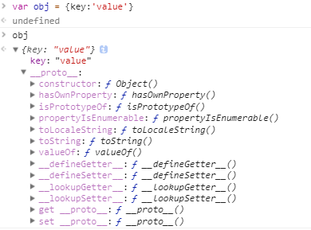

# ECMAScript 对象

参考文档：1、https://developer.mozilla.org/zh-CN/docs/Web/JavaScript/Reference/Global_Objects/Object

2、http://www.365mini.com/page/tag/javascript-object-object

## 一、对象原型链上的方法整理

- `propertyIsEnumerable()` 方法：方法返回一个布尔值，表示指定的 **属性** 是否可枚举。

语法：`obj.propertyIsEnumerable("属性名");`

描述：每个对象都有一个`propertyIsEnumerable()`方法，这个方法可以判断出指定的**属性**是否可被`for...in`循环枚举。

1. 这个属性必须属于实例的，并且不属于原型（属性在原型链上）。
2. 这个属性必须是可枚举的（属性值的数据属性`configurable`为true），也就是自定义的属性。
3. 如果对象没有指定的属性，该方法返回false

如果符合1和2两个要求，就会返回true.

- `isPrototypeOf()`方法：测试一个对象是否存在于另一个对象的原型链上。

