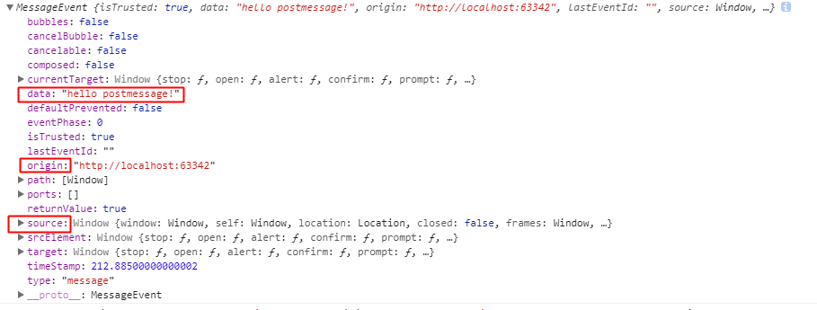

一、 跨域（iframe/ajax/cookie）

<https://segmentfault.com/a/1190000012469713>

## 1、跨域——即浏览器不能执行其他网站的脚本。它是由浏览器的同源策略造成的，是浏览器对javascript施加的安全限制。所谓同源是指，域名，协议，端口均相同

## 2、postMessage —— h5提供的跨域api(ie8等低版本浏览器只支持传字符串)

域A发出消息（Awindow.postMessage(message, targetOrigin, [transfer]);）, 域B接收或者监听消息（Bwindow.addEventListener("message", callback, false);）,回调函数会传入MessageEvent 事件.



反之也成立，参考文档：[html5 postMessage解决跨域、跨窗口消息传递](http://www.cnblogs.com/dolphinX/p/3464056.html)

## 3、window.name —— window.name属性在不同的页面、不同域名（在同一个‘窗口’加载）加载后依旧存在

在 http://localhost:3000/a.html 使用js动态生成一个隐藏的iframe，设置src属性为' http://localhost:3001/c.html '，等这个iframe加载完之后，重新设置src属性为同源的地址' http://localhost:3000/b.html '(b.html是一个空的html文件)，现在iframe与a.html同源，那就可以访问window.name属性（使用iframe.contentWindow.name的方式访问），而name值没有变化，因为window.name属性在不同的页面（甚至不同域名）加载后依旧存在。

## 4、location.hash跨域 —— 创建两层iframe 进行同源父子通信

在 http://localhost:3000/a.html 使用js动态生成一个隐藏的iframe，设置src属性为' http://localhost:3001/c.html#getdata '，在c.html判断hash值是否为'#getdata'，如果为'#getdata'，则在当前的iframe(c.html)中再生成一个隐藏的iframe，其src属性指向' http://localhost:3000/b.html '，因为a.html和b.html同源，所以可以在b.html里面修改a.html的hash值，这样a.html就可以通过获取自身的hash值得到数据

## 5、document.domain —— 具有相同的主域，即document.domain设置成自身或更高一级的父域，且主域必须相同

a.ccdoit.com/a.html页面iframe中设置src为b.ccdoit.com/b.html，在这两个页面设置主域名document.domain = 'ccdoit.com'，b.ccdoit.com/b.html下设置变量data ,在a.ccdoit.com/a.html

页面下通过document.getElementById('iframe').contentWindow.data 获取b.ccdoit.com/b.html中的data值。


## 6、JSONP跨域

在使用JQuery Ajax的JSONP callback方式解决跨域访问问题时，设置$.ajaxSettings.async为false，仍然无法实现同步调用，经查官网发现，JQuery官网已经针对async属性作用效果做了明确说明，不支持dataTypes为jsonp的请求。默认为true 

> By default, all requests are sent asynchronously (i.e. this is set to true by default). If you need synchronous requests, set this option to false. Cross-domain requests and dataType: "jsonp" requests do not support synchronous operation. Note that synchronous requests may temporarily lock the browser, disabling any actions while the request is active.   


## 7、 CORS跨域(Cross-Origin Resource Sharing  : 跨域资源共享 )

### 7.1 直接修改代码，在HTTP响应中添加上对应的头信息； 

假设我们想使用Ajax从a.com的页面上向b.com的页面上要点数据，通常情况由于同源策略，这种请求是不允许的，浏览器也会返回“源不匹配”的错误，所以就有了“跨域”这个说法。但是我们也有解决办法，我们可以再b.com的页面header信息中增加一行代码： 

```php
header("Access-Control-Allow-Origin: *");
```

当我们设置的header为以上信息时，任意一个请求过来之后服务端我们都可以进行处理和响应，那么在调试工具中可以看到其头信息设置，其中见红框中有一项信息是“*Access-Control-Allow-Origin：* ”，表示我们已经启用CORS，如果要限制只允许某个域名的请求，可以这样： 

```php
header("Access-Control-Allow-Origin: http://www.jb51.net");
```

示例：通过CORS跨域请求数据 

```javascript
$.ajax({
  type: "get",
  data: "random="+Math.random(),
  url: "http://demo.jb51.net/phpajax/ajax.php",
  dataType: "json",
  success: function(data) {
    console.log(data);
    $("#result_3").html(data.msg+':'+data.rand);
  },
  error: function() {
   $("#result_3").html('Request Error.');
  }
});
```

我们在另一个网站域名下的ajax.php加上这样的代码： 

```php
header("Access-Control-Allow-Origin: http://www.jb51.net");
$data = array(
  'rand' => $_GET['random'],
  'msg' => 'Success'
);
echo json_encode($data);
```

这就实现了从www.jb51.net页面发起跨域异步请求到域名路径demo.jb51.net/phpajax/ajax.php，并得到响应。 

> 支持同步调用

### 7.2 使用代理服务器，在代理服务器返回响应的时候，再添加响应的头信息。 


例如使用Nginx作为代理服务器 ，需要在对应的**location**中添加如下设置：

```nginx
add_header 'Access-Control-Allow-Origin' '*';  
add_header 'Access-Control-Allow-Credentials' 'true'; 
```


其中 `Access-Control-Allow-Origin` 添加多个允许的白名单，使用**逗号**分隔：

```nginx
Access-Control-Allow-Origin  https://www.google.com,https://www.baidu.com
```

>通过这两个配置，前端就可以跨域访问数据接口了。但是在后续的使用过程中遇到一个问题，就是简单的GET请求都是可以跨域访问到数据的，**但是POST请求的时候浏览器依然报错说跨域访问被禁止**。后来发现，是因为在POST请求时，处理数据过程中发生了异常，导致了浏览器报跨域访问错误。但为什么会这样呢？
>
>经查，这是因为Nginx的add_header指令并不能在HTTP返回码为50X的时候起作用，由于服务器处理逻辑出错，导致了Nginx返回内部服务器错误（500），这个时候add_header是没有起作用的，故会出现这样的问题。


## 8、后端设置代理proxy跨域


## 9、WebSocket跨域


参考文档：

1、[PHP处理Ajax请求与Ajax跨域问题](http://www.jb51.net/article/105425.htm)