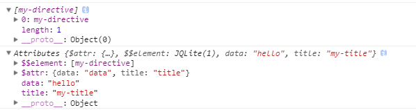

# Directive 指令

用法：

`angular.module("app",[]).directive("directiveName",function(){ `

`return { `

 	`//通过设置项来定义 `

 `}; })`

配置项：

- **restrict** : E(元素),A(属性),C(类),M(注释)，其中默认值为A，其中 E 最常用

  ​

  >`E(Element)：<directiveName></directiveName>`  
  >`A(Attribute)：

`  
  >`C(Class)： 

`  
  >`M(Comment)：<--directive:directiveName expression-->`  

- **priority**：(数字)，可选参数，指明指令的优先级，若在单个DOM上有多个指令，则优先级高的先执行

- **terminal**：（布尔型），可选参数，若设置为true，则优先级低于此指令的其他指令则无效，不会被调用(优先级相同的还是会执行)

- **replace**:（布尔值），默认值为false，设置为true时候，指令的标签将会被组件内的HTML标签替换

- **template**：（字符串或者函数）可选参数

  - 字符串（一段HTML文本）

    > `template:'<h1>hello world!</h1>'`

  - 函数（可接受两个参数：Element 和 Attrs）

    > `<my-directive data="hello" title="my-title"></my-directive>`
    >
    > ​
    >
    > Element是指使用此指令的dom元素；
    >
    > Attrs则实例的属性，它是一个由元素上所有的Attributes属性组成的集合
    >
    > ​
    >
    > `template:function (element,attrs) { `
    >
    > `console.log(element) `
    >
    > `console.log(attrs) `
    >
    > `return '<h1> ! hello world !</h1>'`
    >
    > ` }`

    

- **templateUrl**：（字符串或者函数），可选参数
  - 字符串 —— 代表HTML文件路径的字符串
  - 函数——同上 **template** 函数

- **scope**  

  - true ： 继承父作用域，父子作用域联动，同步更新

  - false ： 表示继承父作用域，并创建自己的作用域（子作用域）;只是继承，子作用域修改不影响父作用域；**子作用域内容修改前，父子联动** ，修改子作用域内容后，父子不联动；

  - { }   ： 表示创建一个全新的隔离作用域，但有如下三个绑定策略来访问父作用域的属性，与隔离的作用域交互：

     -  &  —— & 方式提供一种途经是 directive 能在父 scope 的上下文中执行一个表达式。此表达式可以是一个 function。 

        > `<my-directive fn="doClick()"></my-directive>`

     -  = —— = 通过 directive 的 **attr 属性**的值在局部 scope 的属性和父 scope 属性之间建立双向绑定。父子组件都会一起跟新绑定的数据。

        >  `<my-directive user="userInfo"></my-directive>`

     -  @ —— @ 方式局部属性用来访问 directive 外部环境定义的字符串值，主要是通过 directive 所在的标签**attr属性**绑定外部字符串值。**这种绑定是单向的，即父 scope 的绑定变化，directive 中的 scope 的属性会同步变化，而隔离 scope 中的绑定变化，父 scope 是不知道的**。

        > `<my-directive name="{{name}}" ></my-directive>`

- **transclude** ：（布尔值），可选值，默认为false。设置为true，可以将模板内使用**ng-transclude**的内容替换为组件内的内容，类似于Vuejs的slot

    > `<my-directive data="hello" title="my-title"> <h1> this is transclude !</h1> </my-directive>`
    >
    > 在指令模板内使用 **ng-transclude** ，则 `<h1> this is transclude !</h1>` 不会消失。
    >
    > `template: '<h1>! hello world !  </h1>'`

- **controller** ：字符串或者函数