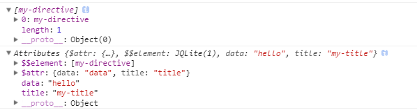

# Directive 指令


用法：

`angular.module("app",[]).directive("directiveName",function(){ `

`return { `

 	`//通过设置项来定义 `

 `}; })`

配置项：

- **restrict** : E(元素),A(属性),C(类),M(注释)，其中默认值为A，其中 E 最常用

  ​

  >`E(Element)：<directiveName></directiveName>`  
  >`A(Attribute)：<div directiveName='expression'></div>`  
  >`C(Class)： <div class='directiveName'></div>`  
  >`M(Comment)：<--directive:directiveName expression-->`  

- **priority**：(数字)，可选参数，指明指令的优先级，若在单个DOM上有多个指令，则优先级高的先执行

- **terminal**：（布尔型），可选参数，若设置为true，则优先级低于此指令的其他指令则无效，不会被调用(优先级相同的还是会执行)

- **replace**:（布尔值），默认值为false，设置为true时候，指令的标签将会被组件内的HTML标签替换

- **template**：（字符串或者函数）可选参数

  - 字符串（一段HTML文本）

    > `template:'<h1>hello world!</h1>'`

  - 函数（可接受两个参数：Element 和 Attrs）

    > `<my-directive data="hello" title="my-title"></my-directive>`
    >
    > ​
    >
    > Element是指使用此指令的dom元素；
    >
    > Attrs则实例的属性，它是一个由元素上所有的Attributes属性组成的集合
    >
    > ​
    >
    > `template:function (element,attrs) { `
    >
    > `console.log(element) `
    >
    > `console.log(attrs) `
    >
    > `return '<h1> ! hello world !</h1>'`
    >
    > ` }`

    


- **templateUrl**：（字符串或者函数），可选参数
  - 字符串 —— 代表HTML文件路径的字符串
  - 函数——同上 **template** 函数


- **scope**  

  - true ： 继承父作用域，父子作用域联动，同步更新

  - false ： 表示继承父作用域，并创建自己的作用域（子作用域）;只是继承，子作用域修改不影响父作用域；**子作用域内容修改前，父子联动** ，修改子作用域内容后，父子不联动；

  - { }   ： 表示创建一个全新的隔离作用域，但有如下三个绑定策略来访问父作用域的属性，与隔离的作用域交互：

     -  &  —— & 方式提供一种途经是 directive 能在父 scope 的上下文中执行一个表达式。此表达式可以是一个 function。 

        > `<my-directive fn="doClick()"></my-directive>`

     -  = —— = 通过 directive 的 **attr 属性**的值在局部 scope 的属性和父 scope 属性之间建立双向绑定。父子组件都会一起跟新绑定的数据。

        >  ```html
        >  <my-directive user="userInfo"></my-directive>
        >  ```

     -  @ —— @ 方式局部属性用来访问 directive 外部环境定义的字符串值，主要是通过 directive 所在的标签**attr属性**绑定外部字符串值。**这种绑定是单向的，即父 scope 的绑定变化，directive 中的 scope 的属性会同步变化，而隔离 scope 中的绑定变化，父 scope 是不知道的**。

        > ```html
        > <my-directive name="{{name}}" ></my-directive>
        > ```

- **transclude** ：（布尔值），可选值，默认为false。设置为true，可以将模板内使用**ng-transclude**的内容替换为组件内的内容，类似于Vuejs的slot

    > `<my-directive data="hello" title="my-title"> <h1> this is transclude !</h1> </my-directive>`
    >
    > 在指令模板内使用 **ng-transclude** ，则 `<h1> this is transclude !</h1>` 不会消失。
    >
    > `template: '<h1>! hello world ! <span ng-transclude></span> </h1>'`

- **controller** ：字符串或者函数 , controller是用来让**不同指令间通信用的**

    - 字符串 —— 表示 **控制器** 的名字(ctrlDemo)，来查找注册在应用中该控制器(ctrlDemo)的**构造函数**

      > html  :
      >
      > ```javascript
      > <my-directive data="hello" title="my-title" font-color="#FF6733">
      >     <h1> this is  transclude !</h1>
      > </my-directive>
      > ```
      >
      > javascript : **controller 后面直接使用字符串**
      >
      > ```javascript
      > app.directive('myDirective',function () {
      >    return {
      >       transclude:true, //必须要使用到这个属性
      >       controller:'directiveCtrl'
      >    }
      > });
      > ```
      >
      > conroller中的定义的指定字符串
      >
      > ```javascript
      > app.controller('directiveCtrl',function ($scope,$element,$attrs,$transclude,$log) {
      >    $transclude(function (clone) {
      >       var a = angular.element('<h2>');
      >       a.css('color',$attrs.fontColor);
      >       a.text(clone.text());
      >       $element.append(a)
      >    });
      >    $log.log($log)
      > })
      > ```
      >
      > ​

    - 函数 —— 后接一个匿名函数

      > ```javascript
      > app.directive('myDirective',function () {
      >    return {
      >       transclude:true,
      >       controller: function ($scope, $element, $attrs, $transclude, $log) {
      >          $transclude(function (clone) {
      >             var a = angular.element('<h2>');
      >             a.css('color', $attrs.fontColor);
      >             a.text(clone.text());
      >             $element.append(a)
      >          });
      >          $log.log($log)
      >       }
      >    }
      > });
      > ```
      >
      > ​
      >
      > controller 可以注入的一些服务：
      >
      > - $scope : 表示指定元素相关联的作用域
      > - $element : 当前指令对应的元素
      > - $attrs : 当前指令元素对应的属性（attributes）
      > - $transclude :  函数，被执行用来克隆元素和操作DOM的函数，该函数里的参数含有指令元素的内容，例如上述的例子：`<h1> this is  transclude !</h1>`
      >
      > 注意，使用该函数需要设置属性  `transclude:true` ，且该函数的作用域会根据使用产生不同的作用域。
      >
      > - $log : 类似于console对象，输出一些调试信息

    > 注意：**controller 与 link 的区别** 

- **controllerAs** ： 语法糖，给指令的控制器设置别名。

  > ````html
  > <div ng-controller="myDirective as direc">
  >   <h1>
  >     {{direc.attr}}
  >   </h1>
  > </div>
  > ````
  >
  > 或者
  >
  > 按照controller的第一种方式定义：
  >
  > ``` javascript
  > ···
  > transclude: true, 
  > controller:'myDirective', 
  > controllerAs:'direc'
  > ···
  > ```

- **compile**: 函数，可以接受一下入参

  - templateElement : 指令所在的元素。对这个元素及其子元素的变形操作；

  - templateAttrs : 指令元素声明的属性，这些属性在编译函数中是共享的；

  - transclude : 表示是不是在指令中插入一些内容，或者变换。。。

    >编译函数可以返回一个对象或者函数：
    >
    >- 返回函数 ： 即 自定义属性中的 **link 函数** ，这里等效于没有compile函数情况下定义的 **link 函数** 
    >
    >- 返回对象 ： 返回一个通过 pre 或者 post 属性注册了的函数对象。（**pre-linking , post-linking**）
    >
    >  > - **Pre-linking function 在子元素被链接前执行**。不能用来进行DOM的变形，以防链接函数找不到正确的元素来链接。
    >  > - **Post-linking function 所有元素都被链接后执行**。
    >
    >​
    >
    >```javascript
    >app.directive('compileDirective',function () {
    >   return {
    >      compile:function (tElement,tAttrs,transclude) {
    >         console.log('编译中 。。。 ')
    >         console.log('tElement ,' , tElement);
    >         console.log('tAttrs ,' , tAttrs);
    >         return function (scope,iElement,iAttrs,controller) {
    >            console.log('链接中。。。')
    >         }
    >      },
    >      link:function () {
    >         console.log('link ... ')
    >      }
    >   }
    >})
    >```
    >
    >**输出结果为 compile区域内的函数打印值，自定义的link 函数 不会输出 ''link ... ''**

  > ​
  >
  > 注意：在编译函数里面不要进行任何DOM变形之外的操作。 更重要的，DOM监听事件的注册应该在链接函数中做，而不是编译函数中。
  >
  > ​
  >
  > ### 补充——编译过程
  >
  > 编译器是 Angular 提供的一项服务，用来遍历DOM节点，查找特定的属性。编译过程分为两个阶段：
  >
  > 1. **编译**：遍历DOM节点，收集所有的指令，返回一个连接函数（link func）
  >
  >    - HTML 编译可以细分为三个阶段：
  >
  >      1. [`$compile`](http://www.angularjs.net.cn/tutorial/api/ng.$compile) 遍历DOM节点，匹配指令。
  >
  >         如果编译器发现某个元素匹配一个指令，那么这个指令就被添加到指令列表中（该列表与DOM元素对应）。一个元素可能匹配到多个指令（也就是一个元素里面可能有多个指令）。
  >
  >      2. 当所有指令都匹配到相应的元素时，编译器按照指令的 `priority` 属性来排列指令的编译顺序。
  >
  >         然后依次执行每个指令的 `compile` 函数。每个 `compile` 函数有一次更改该指令所对应的DOM模板的机会。然后，每个 `compile`函数返回一个 `link` 函数。这些函数构成一个“合并的”连接函数，它会调用每个指令返回的 `link` 函数。
  >
  >      3. 之后，`$compile` 调用第二步返回的连接函数，将模板和对应的作用域连接。而这又会依次调用连接函数中包含的每个指令对应的 `link` 函数，进而在各个DOM元素上注册监听器以及在相应的 [`scope`](http://www.angularjs.net.cn/tutorial/api/ng.$rootScope.Scope) 中设置对应的 [`$watchs`](http://www.angularjs.net.cn/tutorial/api/ng.$rootScope.Scope#methods_$watch)。
  >
  >      经过这三个阶段之后，结果是我们得到了一个作用域和DOM绑定的实时视图。所以在这之后，任一发生在已经经过编译的作用域上的数据模型的变化都会反映在DOM之中。
  >
  >      ​
  >
  > 2. **连接**：将上一步收集到的每个指令与其所在的作用域（scope）连接生成一个实时视图。任何作用域中的模型改变都会实时在视图中反映出来，同时任何用户与视图的交互则会映射到作用域的模型中。这样，作用域中的数据模型就成了唯一的数据源。

  ​

- **link** : link函数负责**注册DOM 事件 和 跟新DOM** ，它也是大部分指令逻辑代码编写的地方。该函数的入参包括：

  - scope : 指令监听的作用域
  - iElement : 指令所在的元素
  - iAttrs : 实例属性对象
  - controller : 控制器实例，使用require请求的指令内部的controller （参考require）

  > ```javascript
  > link:function (scope,element,attrs,controller) {
  >    console.log('link ... ')
  > }
  > ```

  >  **compile 与 link 函数的区别：**
  >
  >  - compile 函数的作用是对指令模板进行转换；
  >
  >  - link的用于 是在模型和视图之间建立关联，包括在元素上注册事件监听；
  >
  >  - **scope在链接阶段才会被绑定到元素上**，因此，compile阶段无法操作scope；编译函数**(compile)**负责对模板DOM进行转换，链接函数**(link)**负责将作用域和DOM进行链接。
  >
  >  - **对于同一个指令的多个实例，compile只会执行一次；link对于指令的每个实例都会执行一次；**
  >
  >  - 一般情况下只需要编写link函数即可；
  >
  >  - 注意！compile与link互斥，如果编写的有自定义compile函数，自定义的link函数就无效，因为 compile函数应该返回一个link函数供后续处理；
  >
  >  - 指令有 **compile function** 是不多见的，因为大部分指令通常只关心如何操作特定的DOM元素实例，而不是去改变它的整体结构。
  >
  >    指令通常有 **link function**。连接函数让指令能够往特定的DOM元素实例的克隆对象上注册监听器，同时可以将作用域中的内容复制到DOM中去。

- **require** :  （字符串或者数组） 一般与link函数配合使用,字符串代表指令的名字，**作为link函数的第四个参数**。该属性适用于多个指令具有重复使用的方法时，将重复的方法写入**某个directive的controller中**，然后再其他组建中 **require该 direative 中的 controller**。

    > demo : 
    >
    > ```html
    > <require-d>
    >     <require-a></require-a>
    >     <require-b></require-b>
    > </require-d>
    > ```

    > ```javascript
    > app.directive('requireD',function () {
    >    return {
    >       template:'<div>hello world <span ng-transclude=""></span></div>',
    >       transclude:true,
    >       controller:function ($scope) {
    >          this.sendMessage = function (directiveScope) {
    >             console.log('directive.message : ',directiveScope.message)
    >          }
    >       }
    >    }
    > })
    >
    > app.directive('requireA',function () {
    >    return {
    >       require:'^requireD',
    >       link:function (scope,e,a,controller) {
    >          scope.message = 'this is directiveA !'
    >          controller.sendMessage(scope)
    >       }
    >    }
    > })
    > app.directive('requireB',function () {
    >    return {
    >       require:'^requireD',
    >       link:function (scope,e,a,controller) {
    >          scope.message = 'this is direativeB!'
    >          controller.sendMessage(scope)
    >       }
    >    }
    > })
    > ```
    >
    > 依次输出：
    >
    > `directive.message :  this is directiveA !`
    >
    > `directive.message :  this is direativeB!`
    >
    > ​
    >
    > 在require的参数前加上前缀，从而改变控制器的行为：
    >
    > - 没有前缀，**指令会在自身提供的控制器中进行查找**，如果找不到任何控制器，则会抛出一个error
    > - ？如果在当前的指令没有找到所需的控制器，则会**将null传给link连接函数**的第四个参数
    > - ^如果在当前的**指令没有找到所需的控制器，则会查找父元素的控制器**
    > - ?^组合
    >
    > ​
    >
    > ```javascript
    > app.directive('requireA',function () {
    >    return {
    >       require:'?requireA',
    >       controller:function () {
    >          this.sendMessage = function (dScope) {
    >             console.log('directive.message , ',dScope.message)
    >          }
    >       },
    >       link:function (scope,e,a,controller) {
    >          scope.message = 'this is directiveA !'
    >          controller.sendMessage(scope)
    >       }
    >    }
    > })
    > ```
    >
    > 可以直接require当前指令，并使用controller中的函数。输出：
    >
    > `directive.message ,  this is directiveA !`
    >
    > ​

